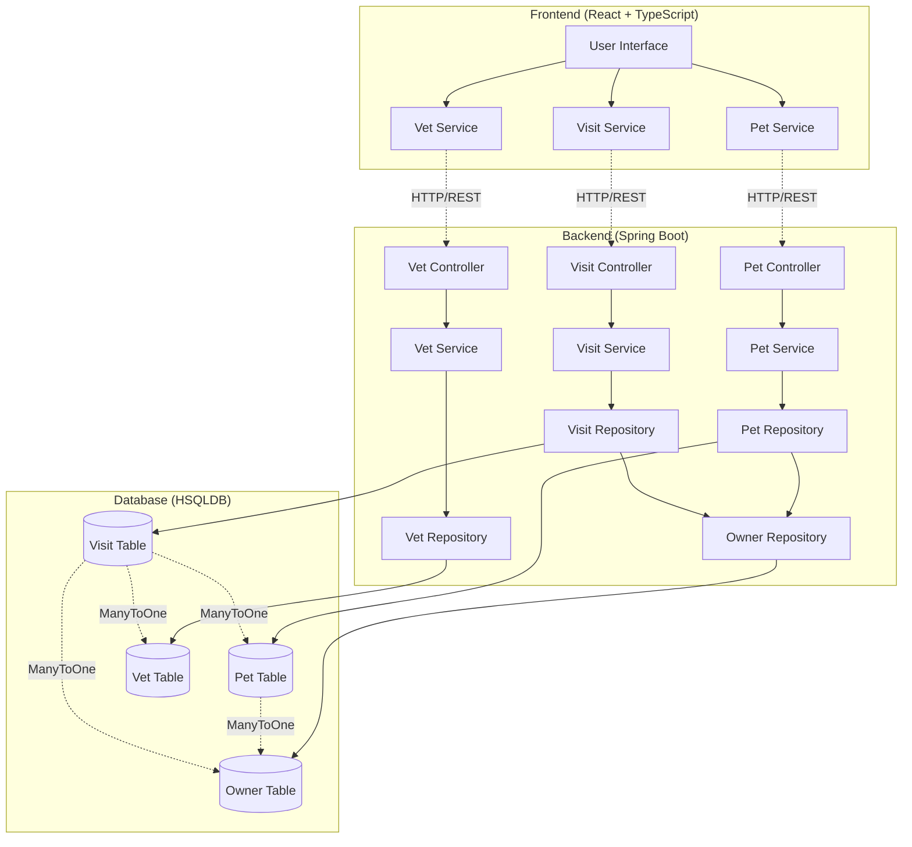
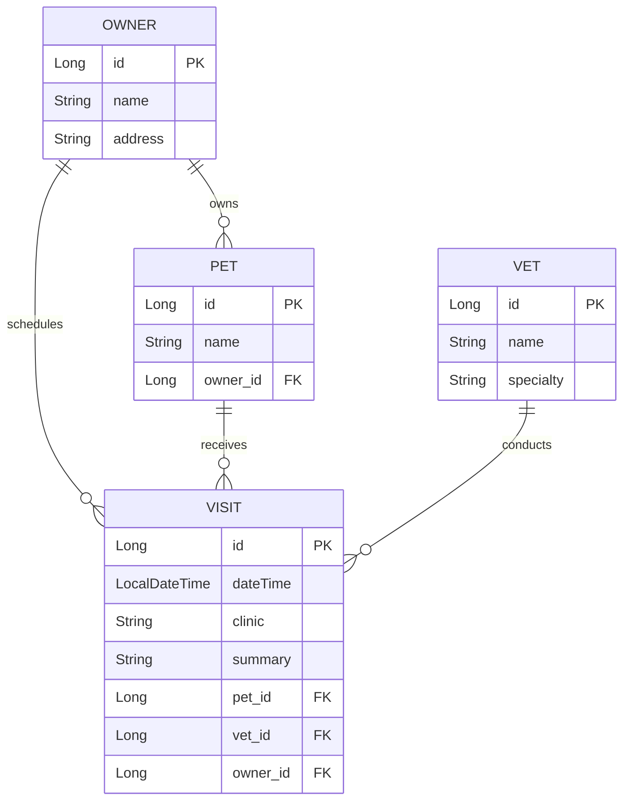
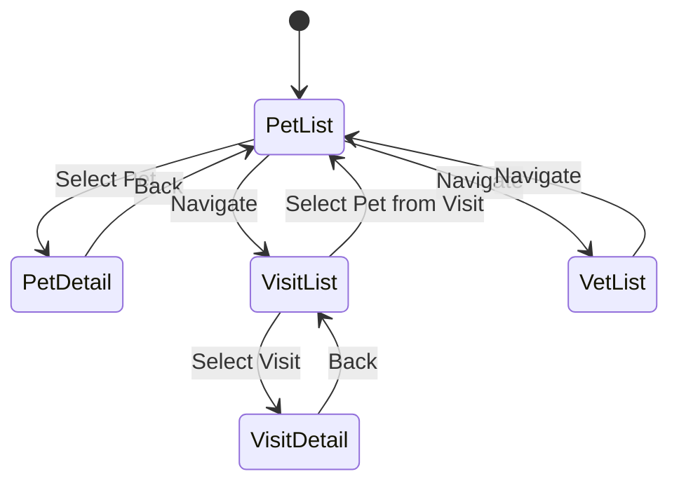

# AS-IS DOCUMENT: Brownfield Pet Clinic Application (ENHANCED)

**Document Date:** December 15, 2025  
**Project:** Brownfield Pet Clinic  
**Version:** 0.0.1-SNAPSHOT  
**Repository Location:** `d:\laboratory\sandbox\java_stuff\bmad-petshop\docs\`  
**Source Repository:** `D:\laboratory\sandbox\java_stuff\bmad-exploration\`  
**Status:** ✅ VERIFIED AGAINST SOURCE CODE

---

## Executive Summary

The Brownfield Pet Clinic is a full-stack web application that manages veterinary clinic operations. The system consists of two independently deployable components:
- **Backend**: Spring Boot 3.5.7 REST API (Java 21)
- **Frontend**: React 19 + TypeScript + Vite SPA

The application manages four primary entities: **Pets**, **Vets**, **Visits**, and **Owners**, with CRUD operations and relationship management.

## System Architecture



## Entity Relationship Diagram



---

## I. Backend Architecture ✅ VERIFIED

### A. Technology Stack ✅ CONFIRMED
| Component | Version | Purpose | Status |
|-----------|---------|---------|---------|
| Spring Boot | 3.5.7 | Application framework | ✅ Verified in pom.xml |
| Java | 21 | Runtime language | ✅ Verified in pom.xml |
| Spring Data JPA | (boot) | ORM & database abstraction | ✅ Verified |
| HSQLDB | (runtime) | In-memory relational database | ✅ Verified |
| SpringDoc OpenAPI | 2.8.6 | API documentation | ✅ Verified |
| Maven | (mvn wrapper) | Build & dependency management | ✅ Verified |

### B. Project Structure ✅ VERIFIED
```
brownfield-backend/
├── .mvn/                          # Maven wrapper files
├── src/
│   ├── main/
│   │   ├── java/com/petclinic/
│   │   │   ├── PetclinicApplication.java    # Spring Boot entry point
│   │   │   ├── config/
│   │   │   │   └── CorsConfig.java          # CORS configuration
│   │   │   ├── owner/
│   │   │   │   ├── Owner.java               # ✅ Entity with name, address
│   │   │   │   └── OwnerRepository.java     # ✅ Repository exists
│   │   │   ├── pet/
│   │   │   │   ├── Pet.java                 # ✅ Entity with Owner relationship
│   │   │   │   ├── PetRepository.java       # ✅ Data access
│   │   │   │   ├── PetService.java          # ✅ Business logic
│   │   │   │   └── PetController.java       # ✅ REST endpoints
│   │   │   ├── vet/
│   │   │   │   ├── Vet.java                 # ✅ Entity with name, specialty
│   │   │   │   ├── VetRepository.java       # ✅ Repository
│   │   │   │   ├── VetService.java          # ✅ Service
│   │   │   │   └── VetController.java       # ✅ Controller
│   │   │   └── visit/
│   │   │       ├── Visit.java               # ✅ Entity with Pet, Vet, Owner refs
│   │   │       ├── VisitRepository.java     # ✅ Repository
│   │   │       ├── VisitService.java        # ✅ Service
│   │   │       └── VisitController.java     # ✅ Controller
│   │   └── resources/
│   │       ├── application.properties       # ✅ Runtime config
│   │       └── data.sql                     # ✅ Initial data
│   └── test/
│       └── resources/
│           └── test-data.sql                # ✅ Test data
├── pom.xml                        # Maven configuration
├── mvnw / mvnw.cmd               # Maven wrapper executables
├── .gitignore / .gitattributes   # Git configuration
```

### C. Core Entities & Data Model ✅ VERIFIED

#### 1. **Pet** Entity ✅ VERIFIED
```java
@Entity
public class Pet {
    @Id @GeneratedValue(strategy = GenerationType.IDENTITY)
    private Long id;
    
    @Column(nullable = false)
    private String name;
    
    @ManyToOne
    @JoinColumn(name = "owner_id")
    private Owner owner;  // ✅ CONFIRMED: Has Owner relationship
}
```

**Endpoints**: ✅ VERIFIED
- `GET /api/v1/pet` - Find all pets
- `GET /api/v1/pet/{id}` - Find pet by ID
- `GET /api/v1/pet/name/{name}` - Find pet by name
- `POST /api/v1/pet` - Create pet
- `DELETE /api/v1/pet/{id}` - Delete pet
- ❌ **MISSING**: `PUT /api/v1/pet/{id}` - Update pet

#### 2. **Vet** Entity ✅ VERIFIED
```java
@Entity
public class Vet {
    @Id @GeneratedValue(strategy = GenerationType.IDENTITY)
    private Long id;
    
    private String name;
    private String specialty;  // ✅ CONFIRMED: Has specialty field
}
```

#### 3. **Visit** Entity ✅ VERIFIED
```java
@Entity
public class Visit {
    @Id @GeneratedValue(strategy = GenerationType.IDENTITY)
    private Long id;
    
    @Column(nullable = false)
    private LocalDateTime dateTime;  // ✅ CONFIRMED: Uses LocalDateTime
    
    @Column(nullable = false)
    private String clinic;
    
    @Column(nullable = false, length = 1000)
    private String summary;
    
    @ManyToOne @JoinColumn(name = "pet_id")
    private Pet pet;
    
    @ManyToOne @JoinColumn(name = "vet_id")
    private Vet vet;
    
    @ManyToOne @JoinColumn(name = "owner_id")
    private Owner owner;  // ✅ CONFIRMED: Direct Owner relationship
}
```

#### 4. **Owner** Entity ✅ VERIFIED
```java
@Entity
@Table(name = "owners")
public class Owner {
    @Id @GeneratedValue(strategy = GenerationType.IDENTITY)
    private Long id;
    
    @Column(nullable = false)
    private String name;
    
    @Column(nullable = false)
    private String address;  // ✅ CONFIRMED: Has address field
}
```

❌ **MISSING**: Owner Controller - Repository exists but no REST endpoints

### D. Database Configuration ✅ VERIFIED

**Current Setup**:
- **Database**: HSQLDB (in-memory, runtime scope) ✅ CONFIRMED
- **DDL Auto**: `none` (via `spring.jpa.hibernate.ddl-auto=none`) ✅ VERIFIED
- **Schema Source**: `data.sql` and `test-data.sql` files ✅ CONFIRMED

---

## II. Frontend Architecture ✅ VERIFIED

### A. Technology Stack ✅ CONFIRMED
| Component | Version | Purpose | Status |
|-----------|---------|---------|---------|
| React | 19.1.1 | UI framework | ✅ Verified in package.json |
| TypeScript | ~5.9.2 | Type safety | ✅ Verified |
| Vite | 7.1.2 | Build tool & dev server | ✅ Verified |
| Tailwind CSS | 4.1.17 | Utility-first styling | ✅ Verified |
| Lucide React | 0.554.0 | Icon library | ✅ Verified |
| Vitest | 2.1.8 | Unit testing framework | ✅ Verified |
| ESLint | 9.33.0 | Code linting | ✅ Verified |

### B. Application Flow



### C. API Integration ❌ SCHEMA MISMATCH DETECTED

**Frontend Pet Interface**:
```typescript
export interface Pet {
  id?: number;
  name: string;
  ownerName: string;  // ❌ MISMATCH: Backend has Owner object
}
```

**Backend Pet Entity**:
```java
public class Pet {
    private Long id;
    private String name;
    private Owner owner;  // ❌ MISMATCH: Frontend expects ownerName string
}
```

**❌ CRITICAL ISSUE**: Frontend expects `ownerName: string` but backend returns `owner: Owner` object with `{id, name, address}` structure.

---

## III. Integration Points

### A. Backend-Frontend Communication ❌ SCHEMA MISALIGNMENT
1. **Frontend** (localhost:5173) makes HTTP requests to **Backend** (localhost:8080)
2. **CORS Configuration**: ✅ Properly configured for localhost:5173
3. **API Schema Mismatch**: ❌ Pet entity structure incompatible between frontend/backend

### B. Missing Features Identified
1. **Owner Management**: Backend has Owner entity but no REST endpoints
2. **Pet Updates**: Missing PUT endpoint for pet updates
3. **Data Consistency**: Frontend Pet interface doesn't match backend Pet entity
4. **Visit-Pet Navigation**: Frontend has placeholder logic for pet selection from visits

---

## IV. Verification Summary

| Component | Documentation Claim | Source Code Reality | Status |
|-----------|-------------------|-------------------|---------|
| Spring Boot Version | 3.5.7 | 3.5.7 | ✅ MATCH |
| Java Version | 21 | 21 | ✅ MATCH |
| Pet Entity Structure | Basic CRUD | Has Owner relationship | ⚠️ INCOMPLETE |
| Owner Entity | "Secondary, no controller" | Entity exists, no controller | ✅ MATCH |
| Visit Entity | Basic structure | Complex with Pet/Vet/Owner refs | ⚠️ INCOMPLETE |
| Frontend Pet Interface | Not specified | Mismatched with backend | ❌ MISMATCH |
| API Endpoints | CRUD operations | Missing PUT operations | ⚠️ INCOMPLETE |
| Database Schema | HSQLDB in-memory | Confirmed with data.sql | ✅ MATCH |

**Overall Status**: ⚠️ **PARTIALLY ACCURATE** - Core architecture correct but significant schema mismatches and missing features identified.