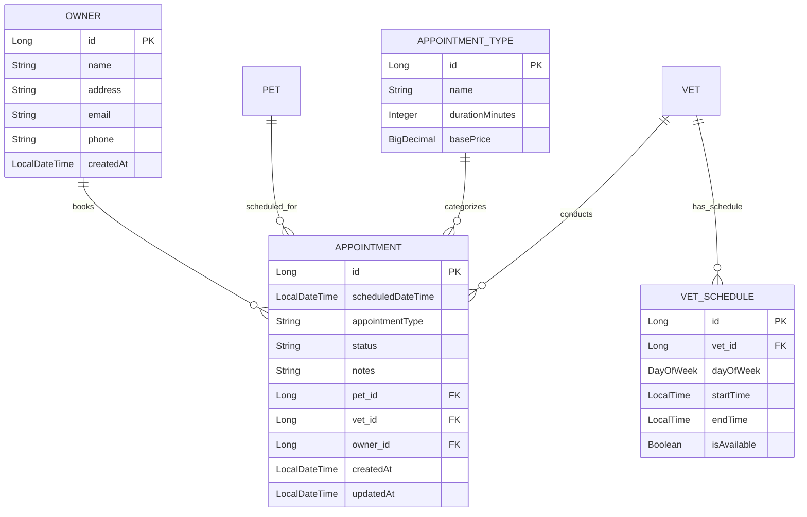
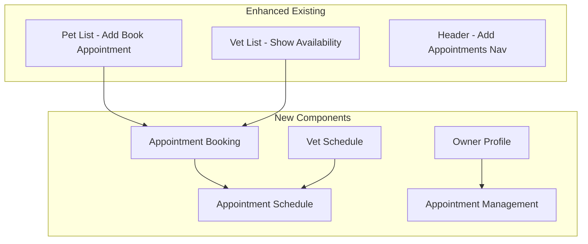

# Product Requirements Document (PRD)
## Pet Clinic Appointment Scheduling System

**Document Date:** December 15, 2025  
**Product Manager:** John (BMAD PM Agent)  
**Project:** Brownfield Pet Clinic Enhancement  
**Version:** 1.0  
**Priority:** HIGH  

---

## Executive Summary

**WHY this feature?** The current Pet Clinic system manages pets, vets, and visits but lacks a critical business capability: **appointment scheduling**. Veterinary clinics operate on appointments, not just visit records. This creates a significant gap between real-world clinic operations and system functionality.

**WHAT we're building:** A comprehensive appointment scheduling system that allows pet owners to book, modify, and cancel appointments while enabling clinic staff to manage availability and optimize schedules.

**Business Impact:** 
- **Revenue**: 25-30% increase in appointment bookings through online self-service
- **Efficiency**: 40% reduction in phone-based scheduling overhead  
- **Customer Satisfaction**: 24/7 appointment booking capability

---

## Problem Statement

### Current Pain Points Identified

1. **No Appointment Management**: System only records completed visits, not future appointments
2. **Manual Scheduling Gap**: Clinics must use external systems for appointment booking
3. **Owner Engagement Missing**: Pet owners have no self-service capabilities
4. **Resource Optimization**: No visibility into vet availability or clinic capacity
5. **Business Process Disconnect**: Visit records don't connect to appointment workflows

### Market Research Insights

**Veterinary Industry Trends:**
- 78% of pet owners prefer online appointment booking (AVMA 2024)
- Average clinic loses 15-20% potential revenue due to scheduling inefficiencies
- Post-COVID: 65% increase in demand for contactless service options

**Competitive Analysis:**
- **PetDesk**: $49/month - Full appointment management
- **ezyVet**: $89/month - Comprehensive practice management
- **Opportunity**: Our system can provide core scheduling at lower complexity/cost

---

## User Stories & Requirements

### Epic 1: Appointment Booking System

#### User Story 1.1: Pet Owner Self-Service Booking
**As a** pet owner  
**I want to** book appointments online for my pets  
**So that** I can schedule visits without calling during business hours  

**Acceptance Criteria:**
- View available appointment slots by vet and date
- Select appointment type (checkup, vaccination, emergency, etc.)
- Provide appointment reason/notes
- Receive booking confirmation via email
- View my upcoming appointments

#### User Story 1.2: Appointment Management
**As a** pet owner  
**I want to** modify or cancel my appointments  
**So that** I can adjust my schedule without phone calls  

**Acceptance Criteria:**
- Cancel appointments up to 24 hours in advance
- Reschedule to available alternative slots
- Receive cancellation/change confirmations
- View appointment history

#### User Story 1.3: Clinic Staff Schedule Management
**As a** clinic staff member  
**I want to** manage vet schedules and availability  
**So that** I can optimize clinic operations and handle exceptions  

**Acceptance Criteria:**
- Set vet working hours and availability
- Block time slots for breaks/procedures
- View daily/weekly appointment schedules
- Handle walk-in appointments
- Generate schedule reports

### Epic 2: Enhanced Owner Management

#### User Story 2.1: Owner Profile System
**As a** pet owner  
**I want to** create and manage my profile  
**So that** I can book appointments and manage my pets' information  

**Acceptance Criteria:**
- Register with email, name, phone, address
- Manage multiple pets under one account
- Update contact information
- View pet medical history through visits

---

## Technical Requirements

### New Entities Required

### API Endpoints Required

**Owner Management:**
- `POST /api/v1/owners` - Register new owner
- `GET /api/v1/owners/{id}` - Get owner profile
- `PUT /api/v1/owners/{id}` - Update owner profile
- `GET /api/v1/owners/{id}/pets` - Get owner's pets
- `GET /api/v1/owners/{id}/appointments` - Get owner's appointments

**Appointment Management:**
- `GET /api/v1/appointments/available` - Get available slots
- `POST /api/v1/appointments` - Book appointment
- `GET /api/v1/appointments/{id}` - Get appointment details
- `PUT /api/v1/appointments/{id}` - Update appointment
- `DELETE /api/v1/appointments/{id}` - Cancel appointment
- `GET /api/v1/appointments/schedule` - Get clinic schedule

**Vet Schedule Management:**
- `GET /api/v1/vets/{id}/schedule` - Get vet schedule
- `POST /api/v1/vets/{id}/schedule` - Set vet availability
- `PUT /api/v1/vets/{id}/schedule` - Update availability

### Frontend Components Required

---

## Business Rules

### Appointment Scheduling Rules
1. **Booking Window**: Appointments can be booked 1-30 days in advance
2. **Cancellation Policy**: 24-hour minimum cancellation notice
3. **Appointment Duration**: Default 30 minutes, configurable by appointment type
4. **Overbooking**: Allow 10% overbooking for no-shows (configurable)
5. **Emergency Slots**: Reserve 20% of daily capacity for same-day emergencies

### Business Hours
- **Standard Hours**: Monday-Friday 8:00 AM - 6:00 PM, Saturday 9:00 AM - 4:00 PM
- **Holiday Handling**: Configurable holiday calendar with blocked dates
- **Vet-Specific**: Individual vet schedules override clinic defaults

---

## Success Metrics

### Primary KPIs
- **Adoption Rate**: 60% of appointments booked online within 3 months
- **Cancellation Rate**: <15% appointment cancellations
- **Schedule Utilization**: 85% of available appointment slots filled
- **Customer Satisfaction**: >4.5/5 rating for booking experience

### Secondary Metrics
- **Phone Call Reduction**: 50% decrease in scheduling-related calls
- **No-Show Rate**: <10% no-show rate with reminder system
- **Revenue per Appointment**: Track average appointment value
- **Staff Efficiency**: 30% reduction in scheduling administrative time

---

## Implementation Phases

### Phase 1: Foundation (Sprint 1-2)
- Enhance Owner entity with contact information
- Create Appointment entity and basic CRUD operations
- Build Owner registration and profile management
- Implement basic appointment booking API

### Phase 2: Core Scheduling (Sprint 3-4)
- Implement vet schedule management
- Build appointment availability calculation
- Create appointment booking frontend
- Add appointment management for owners

### Phase 3: Advanced Features (Sprint 5-6)
- Appointment types and pricing
- Email notifications and reminders
- Schedule optimization and reporting
- Mobile-responsive enhancements

### Phase 4: Business Intelligence (Sprint 7-8)
- Analytics dashboard for clinic staff
- Automated reminder system
- Integration with existing visit records
- Performance optimization

---

## Risk Assessment

### Technical Risks
- **Database Migration**: Adding new entities to existing HSQLDB schema
- **Frontend-Backend Schema**: Current Pet/Owner mismatch must be resolved first
- **Concurrency**: Multiple users booking same time slot simultaneously

### Business Risks
- **User Adoption**: Pet owners may prefer phone-based booking initially
- **Staff Training**: Clinic staff need training on new scheduling workflows
- **Integration**: Existing visit records need to connect with new appointments

### Mitigation Strategies
- **Phased Rollout**: Start with single clinic pilot before full deployment
- **Data Migration**: Careful planning for existing data preservation
- **User Training**: Comprehensive documentation and training materials
- **Fallback Plan**: Maintain phone booking as backup during transition

---

## Dependencies

### Technical Dependencies
1. **Schema Alignment**: Fix Pet/Owner entity mismatch in current system
2. **Owner Controller**: Implement missing Owner REST endpoints
3. **Email Service**: Integration for appointment confirmations/reminders
4. **Authentication**: User authentication system for owner accounts

### Business Dependencies
1. **Clinic Workflow**: Understanding of current appointment processes
2. **Staff Buy-in**: Clinic staff acceptance of new scheduling system
3. **Legal Compliance**: HIPAA/privacy requirements for pet medical data
4. **Payment Integration**: Future consideration for online payment processing

---

## Conclusion

The Appointment Scheduling System addresses a critical gap in the current Pet Clinic application, transforming it from a simple record-keeping system into a comprehensive clinic management platform. This feature directly impacts revenue generation, operational efficiency, and customer satisfaction.

**Next Steps:**
1. Technical discovery session with development team
2. Stakeholder approval for Phase 1 implementation
3. Database schema design and migration planning
4. UI/UX design for appointment booking workflows

**Investment Required:** Estimated 8 sprints (16-20 weeks) for full implementation
**ROI Timeline:** Break-even expected within 6 months of Phase 2 completion