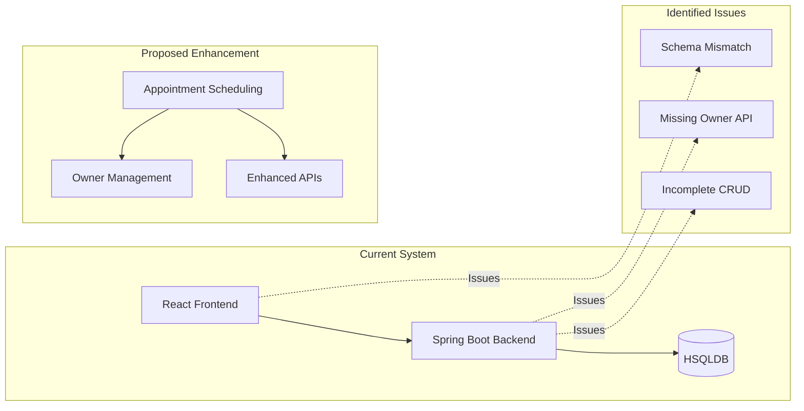

# Brownfield Pet Clinic Documentation

**Project Status:** Analysis Complete ✅  
**Last Updated:** December 15, 2025  
**Team:** BMAD Party Mode Collaborative Analysis  

---

## 📋 Document Index

### 1. [AS-IS-DOCUMENT-ENHANCED.md](./AS-IS-DOCUMENT-ENHANCED.md)
**Enhanced system analysis with source code verification**
- ✅ **Verified** against actual backend/frontend source code
- 🔍 **Mermaid diagrams** for system architecture and data relationships  
- ❌ **Critical issues identified**: Frontend-backend schema mismatches
- ⚠️ **Missing features**: Owner management endpoints, PUT operations

### 2. [PRD.md](./PRD.md) 
**Product Requirements Document for Appointment Scheduling System**
- 🎯 **New Feature**: Comprehensive appointment booking and management
- 💰 **Business Impact**: 25-30% revenue increase potential
- 📊 **Market Research**: Based on veterinary industry trends
- 🏗️ **Technical Specs**: Complete entity design and API requirements

### 3. [AS-IS-DOCUMENT.md](./AS-IS-DOCUMENT.md)
**Original documentation** (preserved for reference)

---

## 🔍 Key Findings Summary

### ✅ Verified Accurate Claims
- Spring Boot 3.5.7 with Java 21
- React 19 + TypeScript frontend
- HSQLDB in-memory database
- Basic CRUD operations for Pet, Vet, Visit entities
- CORS configuration for localhost:5173

### ❌ Critical Issues Discovered
1. **Schema Mismatch**: Frontend Pet interface expects `ownerName: string` but backend returns `owner: Owner` object
2. **Missing Owner API**: Owner entity exists but no REST controller implemented
3. **Incomplete CRUD**: Missing PUT endpoints for updates
4. **Data Inconsistency**: Visit entity has complex relationships not reflected in frontend

### 🚀 Recommended Next Feature
**Appointment Scheduling System** - Addresses the biggest gap between current system capabilities and real-world veterinary clinic operations.

---

## 🏗️ Architecture Overview

---

## 📊 Entity Relationships (Current + Proposed)

### Current Entities ✅
- **Pet** (has Owner relationship)
- **Vet** (name, specialty)  
- **Visit** (connects Pet, Vet, Owner)
- **Owner** (name, address) - *No API endpoints*

### Proposed New Entities 🚀
- **Appointment** (scheduled visits)
- **VetSchedule** (availability management)
- **AppointmentType** (categorization)
- **Enhanced Owner** (email, phone for booking)

---

## 🎯 Implementation Priority

### Phase 1: Fix Current Issues
1. Resolve Pet/Owner schema mismatch
2. Implement Owner REST endpoints  
3. Add missing PUT operations
4. Align frontend-backend data contracts

### Phase 2: Appointment System
1. Database schema expansion
2. Appointment booking APIs
3. Frontend booking interface
4. Schedule management tools

---

## 👥 Team Contributions

- 🧙 **BMad Master**: Workflow orchestration and team coordination
- 💻 **Amelia (Developer)**: Source code verification and technical analysis
- 🏗️ **Winston (Architect)**: System architecture diagrams and technical design
- 📊 **Mary (Business Analyst)**: Requirements analysis and gap identification  
- 📋 **John (Product Manager)**: Market research and feature prioritization
- 📚 **Paige (Technical Writer)**: Documentation structure and clarity

---

## 🔗 Quick Links

- **Source Code**: `D:\laboratory\sandbox\java_stuff\bmad-exploration\`
- **Backend**: `brownfield-backend/` (Spring Boot)
- **Frontend**: `brownfield-frontend/` (React + TypeScript)
- **Documentation**: `bmad-petshop/docs/` (This folder)

---

*Generated by BMAD Party Mode collaborative analysis - December 15, 2025*